# Delhivery Graph-ETA -- Exploratory Data Analysis

_Auto-generated by `eda.py`. Plots in `plots/`._

## Variables analysed

- **target_delay** -- Delivery time + delay-ratio targets the models must predict.
  - vars: actual_time (trip), factor (= actual/osrm), segment_factor, segment_actual_time
- **osrm_features** -- OSRM routing-engine estimates -- the main predictive signal.
  - vars: osrm_time (trip), osrm_distance (trip), segment_osrm_time, segment_osrm_distance
- **distance** -- Distance variables and OSRM-vs-actual distance agreement.
  - vars: actual_distance_to_destination, osrm_distance
- **categorical** -- Route type and scan-type flags.
  - vars: route_type, is_ftl, is_cutoff
- **temporal** -- Time-of-day / day-of-week / seasonality of trips and delays.
  - vars: trip_creation_time -> hour_of_day, day_of_week, od_start_time -> tod_bucket
- **trip_structure** -- Multi-leg structure of a trip (graph path length).
  - vars: segments_per_trip, legs_per_trip
- **graph_structural** -- Node-level graph metrics used as model features (node_metrics.csv).
  - vars: betweenness, in_degree, out_degree, in_degree_weighted, out_degree_weighted, clustering, avg_incoming_delay_factor, bottleneck_score
- **corridor_edge** -- Edge/corridor metrics driving the bottleneck audit (corridor_audit.csv).
  - vars: median_factor, total_trips, pct_delayed, median_osrm_dist_km, is_sparse, is_chronically_delayed
- **relationships** -- Bivariate structure: actual~osrm, delay~distance, delay~graph position, and the model-feature correlation matrix.
  - vars: actual_time~osrm_time, factor~osrm_distance, factor~src_bottleneck_score, feature correlation matrix
- **embeddings** -- Learned node embeddings used as features (GraphSAGE now; node2vec later).
  - vars: emb_0 .. emb_7

Sections executed this run: overview, target_delay, osrm_features, distance, categorical, temporal, trip_structure, graph_structural, corridor_edge, relationships, embeddings, node2vec, task4_route_choice, task5_hub_impact

## 1. Dataset Overview

- Segment-level rows: 144,867; distinct trips: 14,817.
- Trip split -> training: 10,654, test: 4,163
- Facilities (nodes): 1,657.

*Columns with missing values (segment-level)*

| column | missing_% |
| --- | --- |
| source_name | 0.2 |
| destination_name | 0.18 |

## 2. Target & Delay Variables

*Target/delay summary (trip- and segment-level)*

| variable | n | missing | missing_% | mean | std | min | p25 | median | p75 | p95 | p99 | max | skew |
| --- | --- | --- | --- | --- | --- | --- | --- | --- | --- | --- | --- | --- | --- |
| actual_time | 14817 | 0 | 0.0 | 353.892 | 556.248 | 9.0 | 66.0 | 147.0 | 367.0 | 1455.2 | 2925.0 | 6230.0 | 3.366 |
| factor | 14817 | 0 | 0.0 | 2.465 | 2.253 | 0.258 | 1.582 | 1.947 | 2.571 | 5.25 | 11.394 | 82.69 | 10.675 |
| segment_actual_time | 144867 | 0 | 0.0 | 36.196 | 53.571 | -244.0 | 20.0 | 29.0 | 40.0 | 78.0 | 169.0 | 3051.0 | 16.827 |
| segment_factor | 144867 | 0 | 0.0 | 2.218 | 4.848 | -23.444 | 1.348 | 1.684 | 2.25 | 4.429 | 11.5 | 574.25 | 47.373 |
| factor | 144867 | 0 | 0.0 | 2.12 | 1.715 | 0.144 | 1.604 | 1.857 | 2.213 | 3.613 | 6.959 | 77.387 | 17.491 |

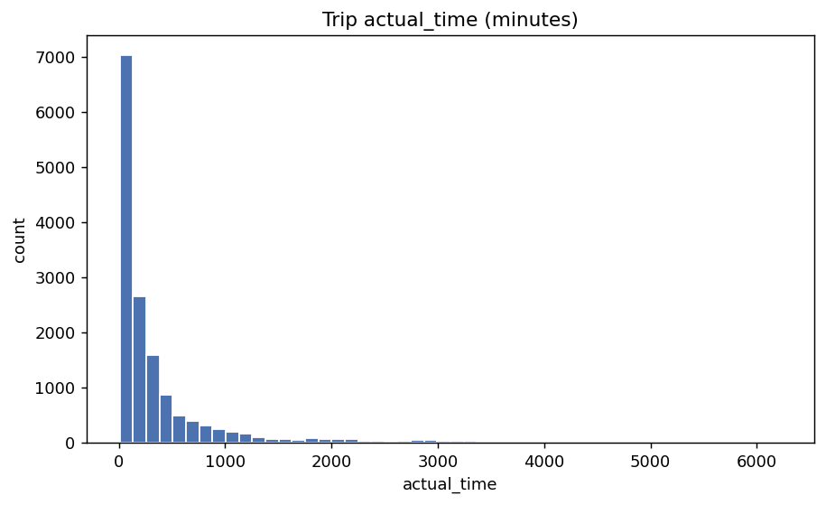

*Trip ETA target -- raw*

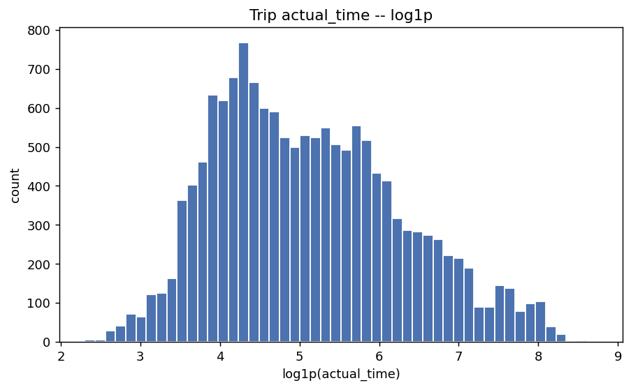

*Trip ETA target -- log1p*

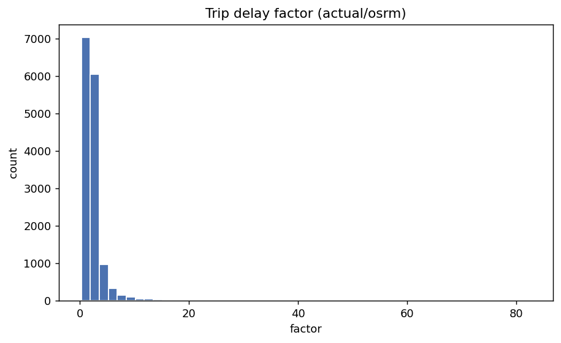

*Delay factor*

- Trip `actual_time` is heavily right-skewed (skew=3.37; median 147 vs max 6230 min).
- Median trip delay factor = 1.95 -> OSRM systematically under-estimates ETA by ~95% on a typical trip.

## 3. OSRM Features

*Trip-level OSRM features*

| variable | n | missing | missing_% | mean | std | min | p25 | median | p75 | p95 | p99 | max | skew |
| --- | --- | --- | --- | --- | --- | --- | --- | --- | --- | --- | --- | --- | --- |
| osrm_time | 14817 | 0 | 0.0 | 180.95 | 314.542 | 6.0 | 31.0 | 65.0 | 185.0 | 833.0 | 1765.84 | 2564.0 | 3.598 |
| osrm_distance | 14817 | 0 | 0.0 | 223.201 | 416.628 | 9.073 | 32.654 | 70.154 | 218.802 | 1103.759 | 2309.24 | 3523.632 | 3.71 |

*Segment-level OSRM features*

| variable | n | missing | missing_% | mean | std | min | p25 | median | p75 | p95 | p99 | max | skew |
| --- | --- | --- | --- | --- | --- | --- | --- | --- | --- | --- | --- | --- | --- |
| segment_osrm_time | 144867 | 0 | 0.0 | 18.508 | 14.776 | 0.0 | 11.0 | 17.0 | 22.0 | 37.0 | 72.0 | 1611.0 | 19.64 |
| segment_osrm_distance | 144867 | 0 | 0.0 | 22.829 | 17.861 | 0.0 | 12.07 | 23.513 | 27.813 | 43.349 | 77.397 | 2191.404 | 26.585 |

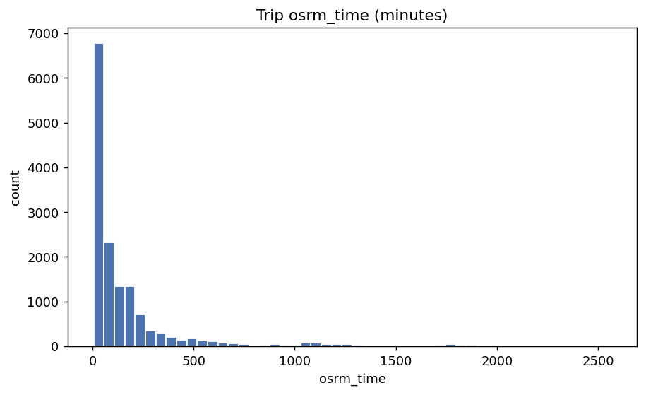

*OSRM time*

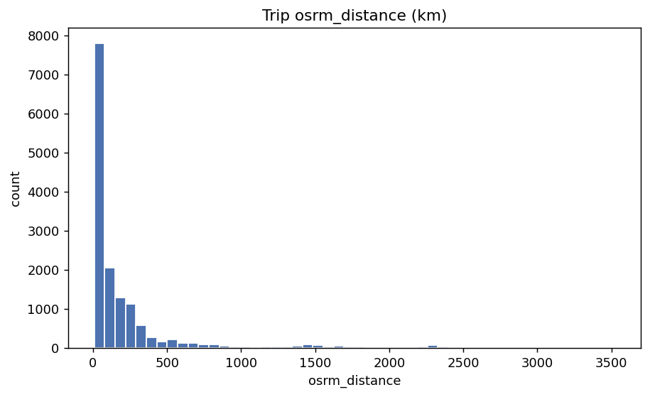

*OSRM distance*

- Trip osrm_time correlates 0.953 with actual_time -- a strong single predictor, so the graph features must add lift beyond OSRM to be worthwhile.

## 4. Distance

*Distance summary (trip-level)*

| variable | n | missing | missing_% | mean | std | min | p25 | median | p75 | p95 | p99 | max | skew |
| --- | --- | --- | --- | --- | --- | --- | --- | --- | --- | --- | --- | --- | --- |
| osrm_distance | 14817 | 0 | 0.0 | 223.201 | 416.628 | 9.073 | 32.654 | 70.154 | 218.802 | 1103.759 | 2309.24 | 3523.632 | 3.71 |
| actual_distance_to_destination | 14817 | 0 | 0.0 | 125.2 | 268.385 | 9.002 | 21.195 | 39.38 | 85.645 | 674.808 | 1532.617 | 1927.448 | 3.957 |

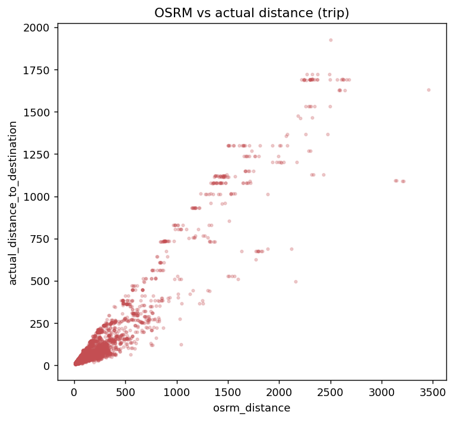

*OSRM vs actual distance*

## 5. Categorical Variables

*route_type (trip-level)*

| value | count | pct |
| --- | --- | --- |
| Carting | 8908 | 60.12 |
| FTL | 5909 | 39.88 |

*is_cutoff (segment-level)*

| value | count | pct |
| --- | --- | --- |
| True | 118749 | 81.97 |
| False | 26118 | 18.03 |

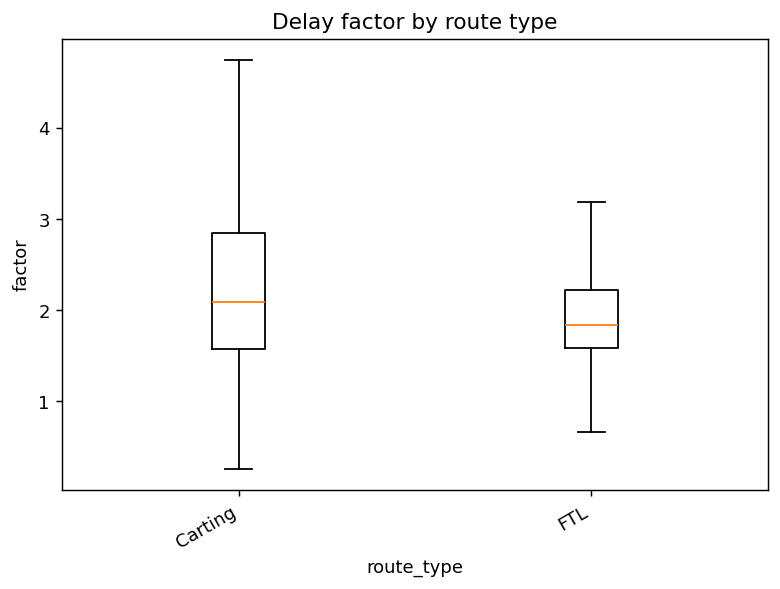

*Delay factor by route type*

- Median delay factor by route type -> Carting: 2.08, FTL: 1.83 (informs the Task-4 FTL-vs-Carting trade-off).

## 6. Temporal Patterns

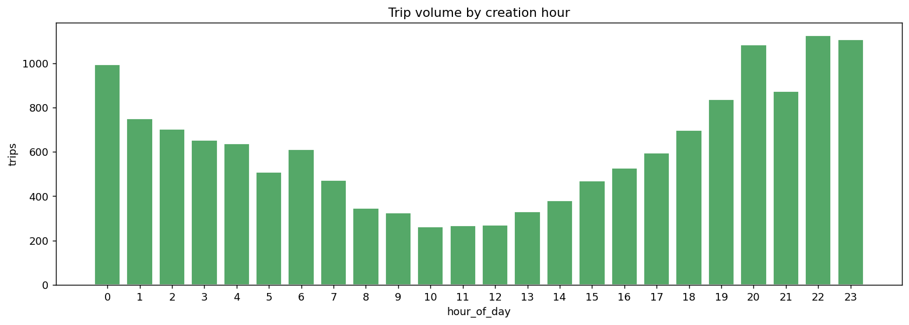

*Volume by hour*

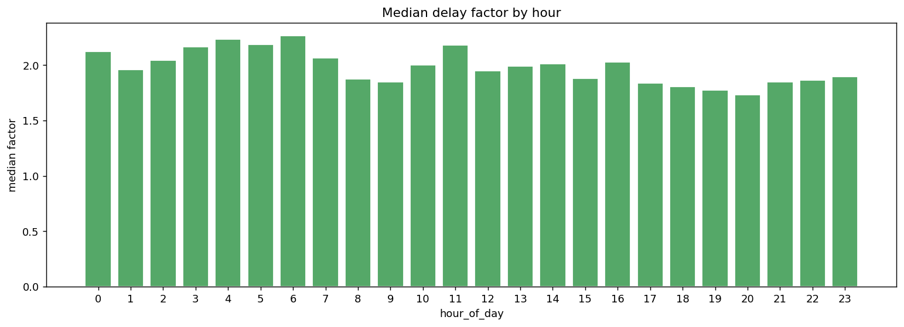

*Delay by hour*

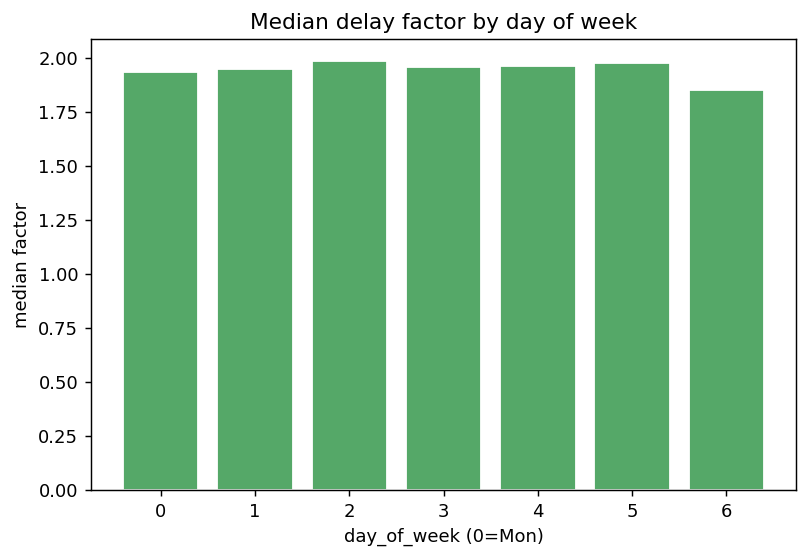

*Delay by day of week*

- Delay factor varies by hour-of-day (median range 0.53) -> time-of-day stratification of edge weights is justified.

## 7. Trip Structure

*Segments / legs per trip*

| variable | n | missing | missing_% | mean | std | min | p25 | median | p75 | p95 | p99 | max | skew |
| --- | --- | --- | --- | --- | --- | --- | --- | --- | --- | --- | --- | --- | --- |
| segments_per_trip | 14817 | 0 | 0.0 | 9.777 | 13.596 | 1.0 | 3.0 | 5.0 | 10.0 | 38.0 | 77.0 | 101.0 | 3.367 |
| legs_per_trip | 14817 | 0 | 0.0 | 1.763 | 1.201 | 0.0 | 1.0 | 1.0 | 2.0 | 4.0 | 6.0 | 8.0 | 1.646 |

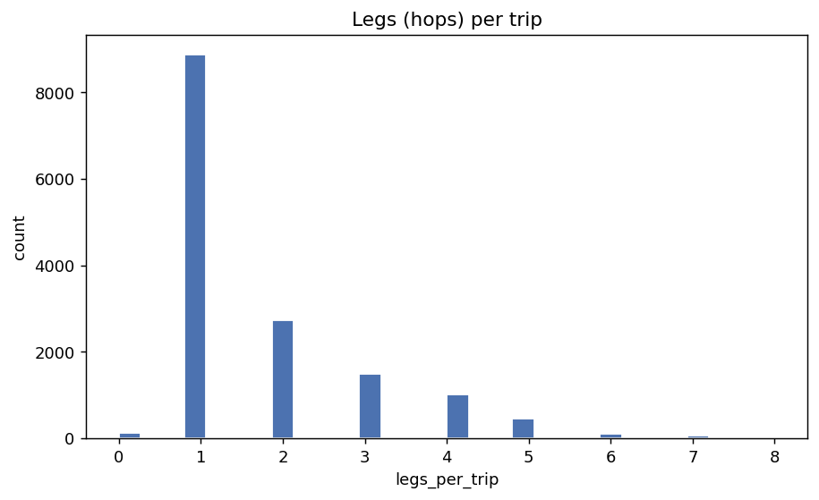

*Legs per trip*

- 39.3% of trips are multi-leg (hub-and-spoke) -> the graph path matters; single-leg trips are the simplest baseline case.

## 8. Graph Structural Metrics (node-level)

*Node-metric summary*

| variable | n | missing | missing_% | mean | std | min | p25 | median | p75 | p95 | p99 | max | skew |
| --- | --- | --- | --- | --- | --- | --- | --- | --- | --- | --- | --- | --- | --- |
| betweenness | 1590 | 0 | 0.0 | 0.001 | 0.008 | 0.0 | 0.0 | 0.0 | 0.001 | 0.004 | 0.02 | 0.214 | 17.642 |
| in_degree | 1590 | 0 | 0.0 | 1.56 | 2.509 | 0.0 | 1.0 | 1.0 | 2.0 | 4.0 | 11.0 | 41.0 | 8.542 |
| out_degree | 1590 | 0 | 0.0 | 1.56 | 2.523 | 0.0 | 1.0 | 1.0 | 2.0 | 4.0 | 11.11 | 48.0 | 9.194 |
| in_degree_weighted | 1590 | 0 | 0.0 | 3.427 | 6.443 | 0.0 | 1.674 | 2.1 | 3.689 | 8.676 | 29.895 | 87.705 | 8.134 |
| out_degree_weighted | 1590 | 0 | 0.0 | 3.427 | 5.41 | 0.0 | 1.741 | 2.154 | 3.877 | 9.642 | 27.124 | 92.336 | 7.552 |
| clustering | 1590 | 0 | 0.0 | 0.277 | 0.397 | 0.0 | 0.0 | 0.0 | 0.5 | 1.0 | 1.0 | 1.0 | 1.032 |
| avg_incoming_delay_factor | 1590 | 0 | 0.0 | 1.832 | 0.937 | 0.0 | 1.638 | 1.939 | 2.154 | 2.969 | 4.672 | 11.306 | 1.268 |
| bottleneck_score | 1590 | 0 | 0.0 | 0.003 | 0.018 | 0.0 | 0.0 | 0.0 | 0.002 | 0.01 | 0.063 | 0.458 | 15.142 |

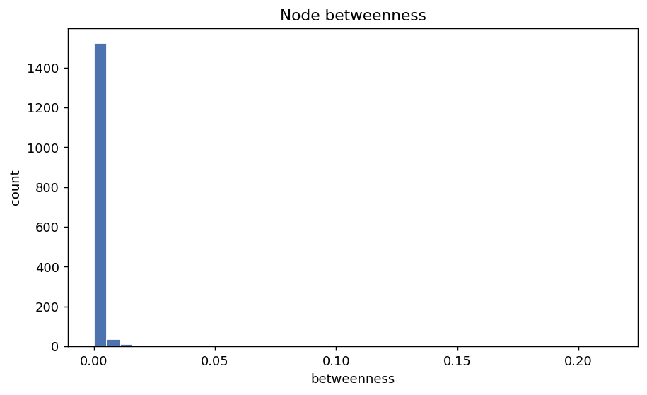

*Node betweenness*

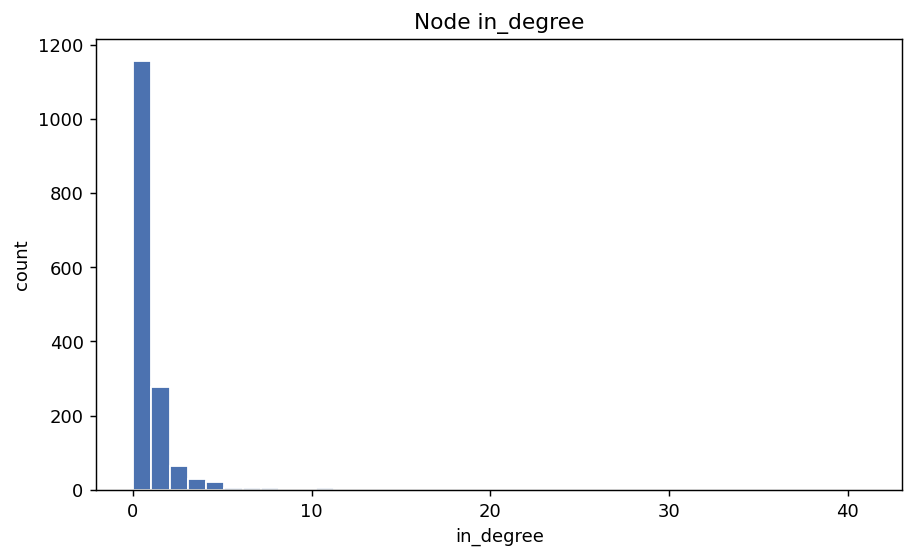

*Node in_degree*

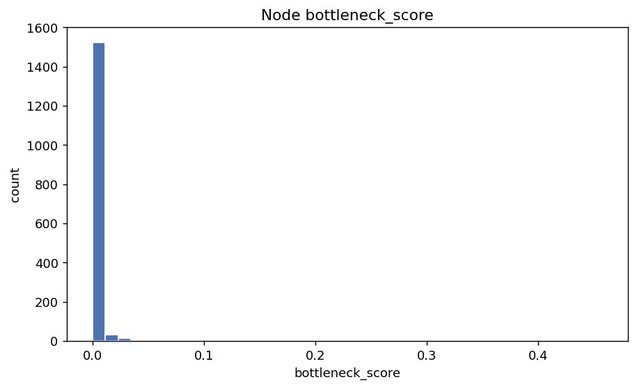

*Node bottleneck_score*

- Betweenness is highly skewed (skew=17.6) -> a few hub facilities dominate routing, consistent with a hub-and-spoke chokepoint structure.

## 9. Corridor / Edge Metrics

*Corridor metric summary*

| variable | n | missing | missing_% | mean | std | min | p25 | median | p75 | p95 | p99 | max | skew |
| --- | --- | --- | --- | --- | --- | --- | --- | --- | --- | --- | --- | --- | --- |
| median_factor | 2481 | 0 | 0.0 | 2.196 | 1.427 | 0.462 | 1.909 | 1.939 | 2.154 | 3.385 | 7.214 | 39.083 | 13.655 |
| total_trips | 2481 | 0 | 0.0 | 7.58 | 8.33 | 1.0 | 2.0 | 6.0 | 11.0 | 19.0 | 39.0 | 100.0 | 4.42 |
| pct_delayed | 2481 | 0 | 0.0 | 0.954 | 0.171 | 0.0 | 1.0 | 1.0 | 1.0 | 1.0 | 1.0 | 1.0 | -4.313 |
| median_osrm_dist_km | 2481 | 0 | 0.0 | 103.081 | 206.773 | 9.382 | 29.548 | 47.982 | 88.278 | 320.119 | 1330.402 | 2326.199 | 5.955 |

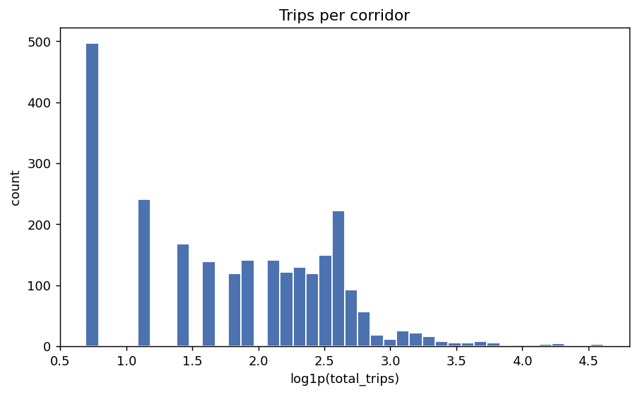

*Trips per corridor (log1p)*

- Corridors with < 2 trips: 20.0%.
- Corridors with < 3 trips: 29.7%.
- Corridors with < 5 trips: 42.1%.
- Corridors with < 10 trips: 68.4%.
- 97.7% of corridors exceed the >20% (factor>1.2) threshold the brief defines for 'chronically delayed'. The threshold is fixed by the problem statement, but the near-universal breach is itself the headline insight: OSRM under-estimates almost everywhere, so prioritise by severity x volume, not the binary flag.

## 10. Relationships

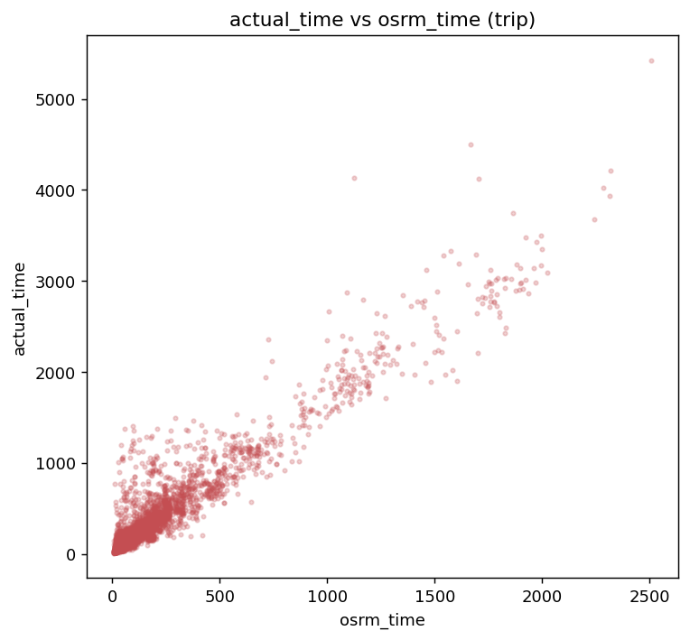

*The core gap OSRM misses*

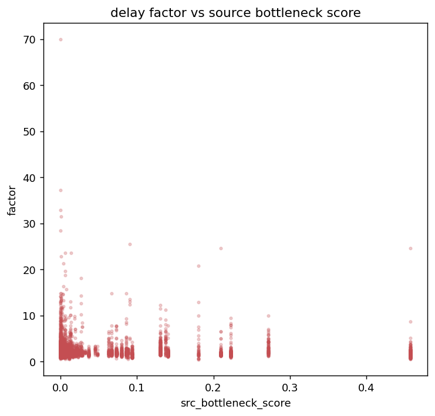

*Does graph position predict delay?*

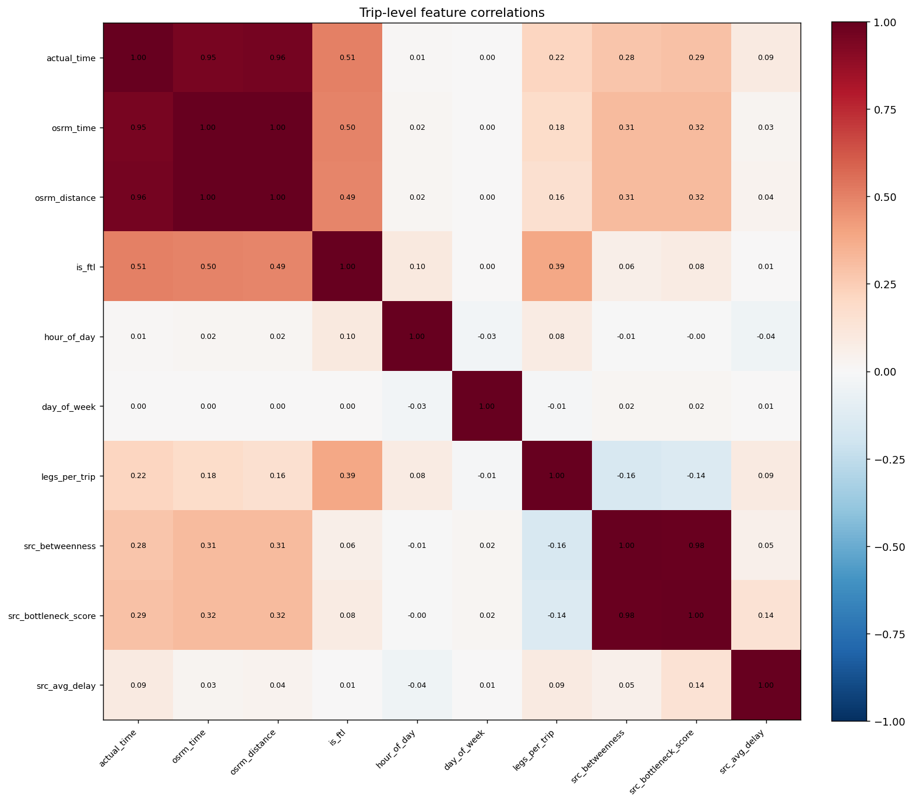

*Feature correlation matrix*

- Top correlates of actual_time -> osrm_distance (0.96), osrm_time (0.95), is_ftl (0.51), src_bottleneck_score (0.29), src_betweenness (0.28).

## 11. Node Embeddings (GraphSAGE)

*Embedding dimension summary*

| variable | n | missing | missing_% | mean | std | min | p25 | median | p75 | p95 | p99 | max | skew |
| --- | --- | --- | --- | --- | --- | --- | --- | --- | --- | --- | --- | --- | --- |
| emb_0 | 1590 | 0 | 0.0 | 0.0 | 0.0 | 0.0 | 0.0 | 0.0 | 0.0 | 0.0 | 0.0 | 0.0 | 0.0 |
| emb_1 | 1590 | 0 | 0.0 | 2.129 | 0.815 | 0.0 | 2.163 | 2.309 | 2.517 | 2.912 | 3.245 | 4.467 | -1.734 |
| emb_2 | 1590 | 0 | 0.0 | 0.0 | 0.0 | 0.0 | 0.0 | 0.0 | 0.0 | 0.0 | 0.0 | 0.0 | 0.0 |
| emb_3 | 1590 | 0 | 0.0 | 0.0 | 0.0 | 0.0 | 0.0 | 0.0 | 0.0 | 0.0 | 0.0 | 0.0 | 0.0 |
| emb_4 | 1590 | 0 | 0.0 | 0.0 | 0.0 | 0.0 | 0.0 | 0.0 | 0.0 | 0.0 | 0.0 | 0.0 | 0.0 |
| emb_5 | 1590 | 0 | 0.0 | 1.992 | 0.763 | 0.0 | 2.029 | 2.163 | 2.308 | 2.777 | 3.169 | 4.079 | -1.74 |
| emb_6 | 1590 | 0 | 0.0 | 0.0 | 0.0 | 0.0 | 0.0 | 0.0 | 0.0 | 0.0 | 0.0 | 0.0 | 0.0 |
| emb_7 | 1590 | 0 | 0.0 | 0.0 | 0.0 | 0.0 | 0.0 | 0.0 | 0.0 | 0.0 | 0.0 | 0.0 | 0.0 |
- GraphSAGE embedding: 8 dims, 6 near-constant. EMB_DIM=8 looks over-sized.

## Hyperparameter / config signals

| signal | value | note | suggested_action |
| --- | --- | --- | --- |
| target_skew | 3.37 | actual_time is heavily right-skewed; squared-error loss over-weights the long tail. | Train models on log1p(actual_time) (or use an L1/Tweedie objective) and invert for scoring. |
| sparse_share_lt5 | 42.1 | 42.1% of corridors have <5 trips; their raw medians are unreliable. | Keep SPARSE_THRESHOLD=5 with the route-type-median fallback (already applied). |
| dead_embeddings | 6.0 | 6/8 embedding dims are near-constant. | Reduce EMB_DIM (e.g. to 4) to cut noise features. |

